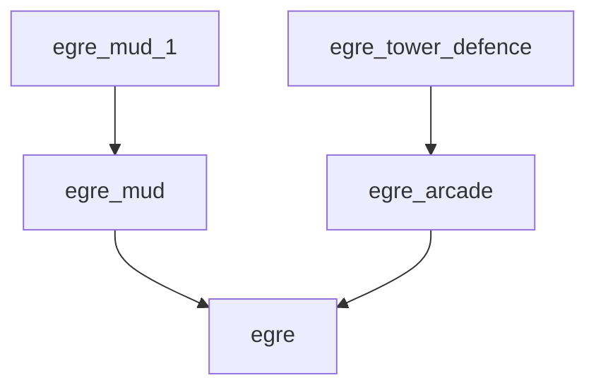

EGRE_MUD_1 - Reference implementation of a MUD using EGRE_MUD

EGRE_MUD_1 is one of several parts being split out of GERLSHMUD.

The goal of EGRE_MUD_1 is to provide the rule processes for a MUD that
will be loaded by the EGRE_MUD engine into EGRE, the Erlang Graph Rules
Engine.

I'm not exactly sure yet how I'm going to do that.
