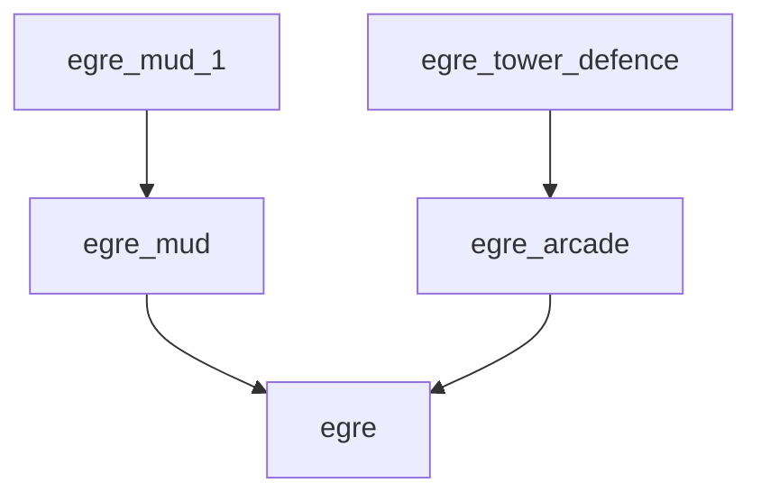

EGRE_MUD_1 - Reference implementation of a MUD using EGRE_MUD

EGRE_MUD_1 is one of several parts that have been split out of GERLSHMUD:
- egre
- egre_mud
- egre_mud_1

### Purpose
This is a proof of concept which might eventually turn into a MUD.
I wondered what would happen if you built a MUD with no "manager", and had everything
in the MUD fend for itself by responding to events in the world.
The entire MUD world is networked together in a graph, and every (local) object sees every event in the world.
Only one object (an object being anything with game logic) ever sees an event at one time, so events
can be ignored, modified, resent, or even just killed.

### Installation
Uh, we haven't really gotten that far yet. You can run the tests with ./t, or ./t <name of test>.
To date, we're just getting tests to work as we get EGRE, EGRE_MUD and EGRE_MUD_1 working in their separate projects.

### Running
Right now there's a *tiny* bit of code to run the MUD, but mostly we're just focused on getting commands working in the tests.
Since most of the tests are passing, the MUD should run.

### Tests
As of 2024-10-20, all but one tests are passing.

### YouTube updates:

---
https://youtu.be/ryaasVMpiS0 - Web logging updates
